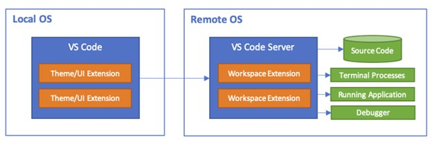
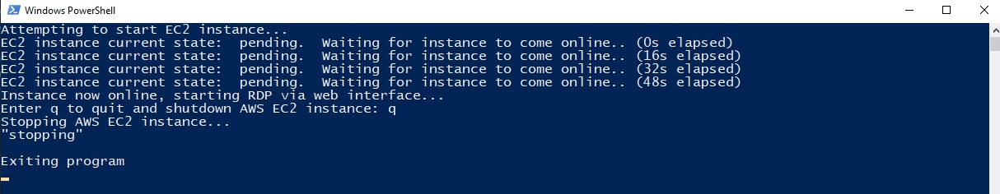
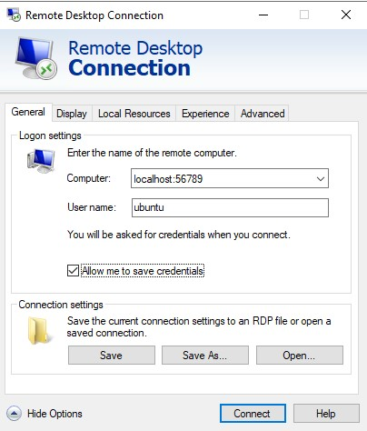

# Introduction
This is a guide for setting up a remote development environment with VS Code inspired by the conceptual illustration below.  This guide assumes the Local OS is *Windows* and the Remote OS is *Linux*.  Additional emphasis is placed on setting up a cloud based *on-demand environment* where the Remote OS can be easily stopped when not in use.


# Background
Remote development paradigms are great.   This [VS Code article](https://code.visualstudio.com/docs/remote/remote-overview) presents a laundry list of several benefits but here are the main points for me.  
- Access to a UNIX based operating system (key for me as primarily a Windows user)
- Keeps Local OS clean (e.g. no need to bog down your local workstation with Docker etc)
- Faster than your laptop (with on demand access to more compute and storage)

Despite the benefits, there are also some things about remote development that I find a bit *annoying*.  
- No auto-hibernation and therefore incurring cost while remote machines are idle
- No desktop GUI (this sucks because I like to run E2E tests with Puppeteer)
- No automated provisioning and therefore cumbersome spin up and tear down

Recently I took a fresh look at three different options (Codespaces, Cloud9, and Self-managed EC2) in search of a solution to these annoyances.  Here it the top line comparison.

| | Github Codespaces | AWS Cloud9 | Self-managed EC2
| --- | --- | --- | --- |
| Auto-hibernation | Included | Requires customization (for VS Code) | Requires customization
| Desktop GUI | Not Included | Not Included | Included
| Automated provisioniong | Included | Included | Requires customization
| Operating Costs (2 cores 4-8GB RAM) | $0.18/hr | $0.96/hr | $0.14/hr

Enterprise users may have different needs, but for me as a casual developer looking for a performant yet cost-effective Unix-based development environment with desktop GUI, a Self-Managed EC2 instance is what I am mostly using.  Admittedly the setup is a pain.  So, the rest of this guide will outline the steps I followed to setup Ubuntu Desktop as a Self-Managed EC2 instance.

# Design
The diagram below illustrates the core system interactions that will be implemented with this guide.

[](https://mermaid.live/edit#pako:eNqtVMFOwzAM_RWT0yrWA0McqMQkxJBADDYtElx6SVvTRaRJSVIQmvbvuOsm6NgKCHpoHNt5fnFsL1hqMmQRc_hcoU5xJEVuRRFroE9U3uiqSNA2-7FJhYIJh57zwvqqDF1qZemDcDg8nGFhPK6slxeDIAJe-wDJIDX5Ezj0zh84XIyvgwZv60hIMOHeGBFcb2Bo8dhAKGNKmEqdr5SVa7S_JzvC2prgFlfOb4MPyL_w_UxNKF9nh3RnE62kxg_Td8w7wo1FpdM5zEZTcOicNLoNazH1YPOkd3R61IfB4Jh-JydB26kd_55ei-qj6305v9qE25Wybsyv2mi1HHwFuKuDW5nPPZhH2HVwTTDDF1SmLFB7eDX2yZUi3Uow6qytMKWHG6kU5YjawPku_j8rfarKrsrfyQSV-59K4AqxbCPtS9_-ok2M8dRXn-htuJLA-qxAWwiZ0exY1OqY-TkWGLOIxETQTVisl-RXDxH-plMWeVthn1VlRt27njMsehR06z7DTHpjb5thtJpJy3ejwmAm)

# Remote OS setup on AWS
## Prequisites
- An Active AWS account with administrator permissions.  Note it may take several hours for some services to be fully activated after creating a new account.  https://docs.aws.amazon.com/vpc/latest/userguide/vpc-getting-started.html
- Administrator permissions on your Windows machine for installing AWS CLI and the Session Manager plugin
## Step 1: Configure AWS account administration    
- Create Administrator IAM user and user group https://docs.aws.amazon.com/IAM/latest/UserGuide/getting-started_create-admin-group.html#getting-started_create-admin-group-console
    - IMPORTANT: When creating the user on the **Add user** page **Select AWS access type** section, choose both the **Access key** and **Password** options.  Remember to save the user credentials for later.
- Create an IAM instance profile for SSM that can later be attached to your EC2 instance: https://docs.aws.amazon.com/systems-manager/latest/userguide/setup-instance-profile.html#instance-profile-add-permissions
    ```
    *NOTE*
    Make a note of the role name (e.g. SSMInstanceProfile). You will choose this role when you create new instances that you want to manage by using Systems Manager.
    ```
    
## Step 2: Spin up EC2 instance
- Provision an EC2 instance with a desktop environment.
    - For ease of setup I recommend the netCUBED Ubuntu Linux Desktop on the AWS Marketplace: https://aws.amazon.com/marketplace/pp/prodview-vkoypmw6w3ta2?sr=0-2&ref_=beagle&applicationId=AWSMPContessa
        - Launch through EC2 
            - Creating new security group and key pair [.pem] as needed.  Remember to save .pem file in you user's .ssh directory (e.g. ~/.ssh/YOUR_KEY_PAIR.pem)
            - Add additional storage as needed
            - Advanced Details -> Assign the SSMInstanceProfile created above to the IAM Instance Profile
- Configure Systems Manager to automatically update SSM Agent on EC2 instance: https://docs.aws.amazon.com/systems-manager/latest/userguide/ssm-agent-automatic-updates.html#ssm-agent-automatic-updates-console

## Step 3: Verify Remote OS Setup
- Connect to EC2 instance via RDP by opening a new browser tab and entering the public IP of your instance (e.g. https://18.245.21.43 where 18.245.21.43 is the public IP address of the instance).  The default user is `ubuntu` and the default password is the instance ID.
    - Launch a terminal session and confirm ssm agent is running with the following commands
        ```bash
        $ sudo snap list amazon-ssm-agent
        $ sudo snap services amazon-ssm-agent
        ```
- Exit the RDP session

# Configure Local OS
## Prequisites
- VS Code Installed: https://code.visualstudio.com/ with Remote - SSH extension: https://code.visualstudio.com/docs/remote/ssh-tutorial#_install-the-extension

## Step 1: AWS CLI Configuration
- Install AWS CLI v2 (or newer) on local machine: https://docs.aws.amazon.com/cli/latest/userguide/getting-started-install.html
- Create an AWS CLI profile for 'remote-dev-admin'
```bash
$ aws configure --profile remote-dev-admin
AWS Access Key ID [None]: YOUR_ADMIN_IAM_USER_ACCESS_KEY_CREATED_ABOVE
AWS Secret Access Key [None]:  YOUR_ADMIN_IAM_USER_SECRET_KEY_CREATED_ABOVE
Default region name [None]: us-east-1
Default output format [None]: json
```
- Install AWS Session Manager plugin for the AWS CLI: https://docs.aws.amazon.com/systems-manager/latest/userguide/session-manager-working-with-install-plugin.html#install-plugin-windows
    - NOTE: A reboot was required for me on Windows after installing the Session Manager plugin in order to connect successfully with VS Code below

## Step 2: Test EC2 startup script
- Copy the ec2-startup-script.ps1 file from this repo to your local OS and update line 1 with YOUR_EC2_INSTANCE_ID.  This script will boot up you EC2 instance and launch an RDP session in the browser
- Run ec2-startup-script.ps1 and leave PowerShell window running in the background

## Step 3: VS Code configuration
- Add the following entry to your SSH config file (remember to substitute YOUR_INSTANCE_ID in the ProxyCommand below and YOUR_KEY_PAIR in the IdentityFile).  Refer to this article as an aid: https://code.visualstudio.com/docs/remote/ssh-tutorial#_connect-using-ssh
```bash
Host ubuntu-desktop-on-EC2-001
    IdentityFile ~/.ssh/YOUR_KEY_PAIR.pem
    User ubuntu
    ProxyCommand C:\Windows\System32\WindowsPowerShell\v1.0\powershell.exe "aws ssm start-session --profile remote-dev-admin --target YOUR_INSTANCE_ID --document-name AWS-StartSSHSession"
```
- Open connection

## Step 4: Shutdown
- When you are finished working in VS Code return to the PowerShell window and enter q to trigger the command that will shutdown your remote OS


# Conclusion
Message me if you give this a try or if you use something similar.  I'd love to hear how others feel about this paradigm.

# Troubleshooting
- Creating an Access key for IAM Administrator after the user has been created: https://docs.aws.amazon.com/cli/latest/userguide/cli-configure-quickstart.html#cli-configure-quickstart-creds-create
- Attach the SSM IAM role (created above) to the newly launched EC2 instance if not completed during launch: https://docs.aws.amazon.com/systems-manager/latest/userguide/setup-launch-managed-instance.html#setup-launch-managed-instance-existing
- SSM agent is not installed: https://docs.aws.amazon.com/systems-manager/latest/userguide/ssm-agent.html
- If not able to establish an SSH connection via VS Code Remote Development due to a 'Permission denied (publickey)' error or permissions error on .ssh/config then update permissions granted on your .ssh directory
    - https://windowsreport.com/bad-owner-or-permissions-on-ssh-config/
    - https://99robots.com/how-to-fix-permission-error-ssh-amazon-ec2-instance/
    - https://gist.github.com/jaskiratr/cfacb332bfdff2f63f535db7efb6df93
- If able to establish SSH connection via PowerShell but not VS Code Remote Development extension due to a ‘non-existent pipe’ error then try deleting .ssh/known_hosts and then reconnecting: https://github.com/microsoft/vscode-remote-release/issues/1398
- If RDP opens and then abruplty ends, check that you have entered your password correctly: http://woshub.com/fix-saved-rdp-credentials-windows/#:~:text=By%20default%2C%20Windows%20allows%20users,in%20the%20RDP%20client%20window.

## First Time Connect
- You can reach your desktop environment through a Remote Desktop Client (such as the Microsoft Remote Desktop Application). The hostname is simply the public IP (or private IP for enterprise VPCs). Make sure you enter the username and password before you connect. On Windows, click "Show Options" and fill in the username (ubuntu), click "Allow me to save credentials", click "Connect", enter password (your instance ID) when prompted, click yes when prompted to connect despite certificate errors.

# Inspiration
- https://www.parallels.com/blogs/ras/rdp-file-configuration/
- https://code.visualstudio.com/docs/remote/remote-overview
- https://aws.amazon.com/blogs/architecture/field-notes-use-aws-cloud9-to-power-your-visual-studio-code-ide/

# Optional
- Configurging RDP Client
    - Open a new PowerShell terminal and use AWS CLI to start an SSM port forwarding session: https://docs.aws.amazon.com/systems-manager/latest/userguide/session-manager-working-with-sessions-start.html#sessions-start-port-forwarding
        ```bash
        $ aws ssm start-session --profile remote-dev-admin --target YOUR_INSTANCE_ID --document-name AWS-StartPortForwardingSession --parameters portNumber="3389",localPortNumber="56789" 
        ```
    - Configure RDP file
        - Run Remote Desktop Connection and configure logon settings as illustrated below
        
        - Click 'Connect' and enter password (your EC2 instance id) when prompted
        - Exit the RDP session and click 'Save' to store the connection settings to an RDP file

# License
MIT